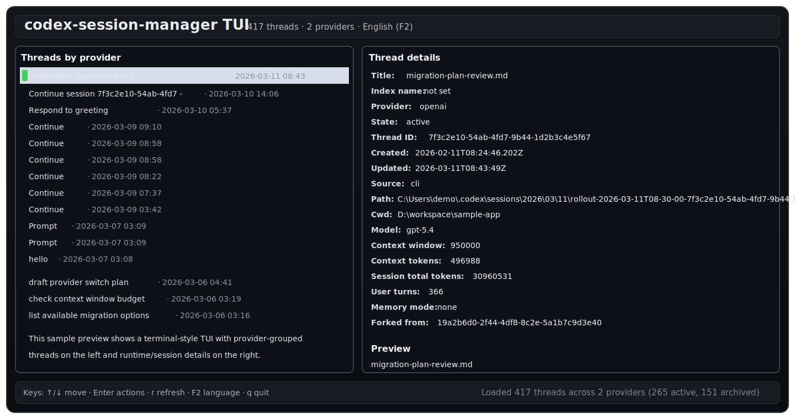

# CSM

Codex Session Manager

[简体中文说明](README.zh-CN.md)

CSM is a source-backed CLI and TUI for inspecting, repairing, and migrating
Codex sessions. It works directly with rollout files and Codex configuration
state, while preserving Codex-native behavior for operations such as
compaction, rollback, fork, and provider migration.

Running the binary with no arguments opens the interactive TUI.



## Repository

- Repository name
  - `csm`
- Project name
  - `Codex Session Manager`
- Suggested GitHub description
  - `Source-backed CLI and TUI for inspecting, repairing, and migrating Codex sessions.`
- Suggested topics
  - `codex`
  - `codex-session-manager`
  - `session-manager`
  - `cli`
  - `tui`
  - `jsonl`
  - `migration`
  - `conversation-repair`

## Overview

CSM is designed for operators and power users who need low-level control over
Codex conversation state. It provides visibility into recorded threads,
targeted JSONL repair tools, native Codex runtime operations, and a guided
switch workflow for moving a thread across providers or models without losing
track of runtime constraints.

The project intentionally reuses Codex-native semantics where that matters. It
does not invent hidden thread state, and it does not fake migration by blindly
rewriting history.

## Recommended Entry Point

For most day-to-day session switching and recovery work, start with
`smart`.

`smart` is the primary high-level workflow in CSM. It presents a guided
provider/model picker, shows a pre-execution plan, and then decides whether the
selected thread should stay on the same thread with runtime repair or move
through the native migration path.

```powershell
cargo run -- smart <thread-id-or-rollout-path>
```

This tool is intentionally built on Codex's existing Rust internals instead of
re-implementing thread behavior:

- `ThreadManager::fork_thread`
- `ThreadManager::resume_thread_from_rollout`
- `RolloutRecorder::get_rollout_history`
- `read_session_meta_line`
- `read_repair_rollout_path`
- `append_thread_name`
- `find_thread_path_by_id_str`
- `find_archived_thread_path_by_id_str`
- `find_thread_path_by_name_str`
- `resume_command`
- `ConfigEditsBuilder`

## Why CSM

- Inspect real session history and rollout-derived metadata from `$CODEX_HOME`
- Repair broken or stale session metadata without hand-editing large JSONL logs
- Drive native Codex operations such as compact, rollback, fork, and migrate
- Offer a higher-level `smart` workflow on top of the low-level primitives

## Scope

CSM operates on real Codex rollout files and Codex config/state under
`$CODEX_HOME`, but it is shipped as a separate binary outside the main Codex
CLI.

## Design

- Source-backed
  - Every operation maps to real Codex storage semantics or real Codex runtime
    APIs.
- Safe-by-default repair
  - `rewrite-meta` only touches the first `SessionMeta` record.
  - `repair-resume-state` only rewrites persisted rollout window hints used by
    resume/fork startup.
  - Migration creates a new thread instead of mutating old history into an
    incompatible runtime shape.
- Operational focus
  - Targets can be resolved by rollout path, thread id, or thread name.
  - Commands are built for repair, migration, compaction, archival, and resume
    workflows.

## Layout

- `src/lib.rs`
  - Library entrypoint that exposes the reusable `run(Cli)` surface.
- `src/main.rs`
  - Thin binary wrapper that only parses CLI args and delegates to the library.
- `src/commands.rs`
  - Command orchestration and output shaping.
- `src/runtime.rs`
  - Runtime/config/profile resolution and shell-safe resume helpers.
- `src/summary.rs`
  - Rollout-derived thread summary logic.
- `src/operations.rs`
  - Native Codex thread operations such as repair, fork, compact, rollback, and archive.
- `src/rollout_edit.rs`
  - In-place JSONL surgery for session metadata and resume-state repair.
- `src/tests.rs`
  - Regression coverage, including the real rollout fixture in `test/`.

## TUI

- `codex-session-manager`
  - Enters a two-level TUI with no subcommand.
- Main screen
  - Lists all active + archived interactive threads, grouped by provider.
  - Uses the real session-index thread name first, then falls back to the
    first user message preview, then thread id / rollout filename.
  - Shows per-thread provider, archived state, timestamps, rollout path, cwd,
    preview, current model, context window, and token summary in a split view.
  - Runtime summary loading is debounce-delayed slightly so fast scrolling does
    not stall the list.
  - Detects the initial UI language from the system locale.
- Action screen
  - `Enter` on a thread opens a second-level action menu built from the same
    commands exposed by the CLI.
  - Includes `smart`, a guided provider/model switch flow with list selection.
  - Actions that need extra args open an inline prompt, then execute through
    the same Clap parsing + command implementation as the normal CLI.
- Keys
  - `↑/↓` move, `Enter` open actions / confirm, `Esc` go back, `r` reload,
    `F2` toggle English/Chinese, `q` quit.

## Commands

- `show`
  - Resolve a target by rollout path, thread id, or thread name.
  - Print derived session metadata, or `--json`.
- `rename`
  - Update the thread name stored in `session_index.jsonl`.
- `repair`
  - Rebuild SQLite thread metadata from rollout history.
- `rewrite-meta`
  - Rewrite the first `SessionMeta` line in the rollout file, then reconcile
    SQLite state.
- `repair-resume-state`
  - Rewrite persisted `TurnStartedEvent.model_context_window` and
    `TokenCountEvent.info.model_context_window` values inside the rollout.
  - Use this for in-place resume-state repair when an old thread only becomes
    resumable again after normalizing stale large-window telemetry.
- `fork`
  - Fork a thread through Codex's native thread manager, with optional model /
    provider / context-window overrides.
- `archive` / `unarchive`
  - Move rollout files between active and archived storage using the same path
    rules Codex app-server uses.
- `copy-session-id` / `copy-cwd` / `copy-rollout-path`
  - Resolve a target and print/copy the requested field.
- `copy-deeplink`
  - Print/copy the canonical `codex resume ...` command built from Codex
    source.
- `compact`
  - Resume a thread, submit native `Op::Compact`, wait for completion, and
    reconcile metadata.
- `rollback`
  - Resume a thread, submit native `Op::ThreadRollback`, wait for completion,
    and reconcile metadata.
- `migrate`
  - Preflight a target context window against persisted context-token state,
    optionally compact the source thread first, then fork to a new
    provider/model/profile.
- `smart`
  - Opens an interactive provider/model picker.
  - This is the recommended command for most users.
  - The confirm step shows the planned execution path before anything runs.
  - Provider choices come from global `config.toml` entries and referenced
    profile providers.
  - Same-provider switches automatically compact if needed, repair persisted
    context-window hints, and write a runtime profile.
  - Cross-provider switches automatically call the migration path with the
    selected provider/model/runtime shape.

## Examples

```powershell
cargo run --
cargo run -- smart 019cd66f-f4ea-7022-802b-7007c11cea97
cargo run -- show 019cd66f-f4ea-7022-802b-7007c11cea97
cargo run -- show "my old thread" --json
cargo run -- rename 019cd66f-f4ea-7022-802b-7007c11cea97 "Provider migration"
cargo run -- repair 019cd66f-f4ea-7022-802b-7007c11cea97
cargo run -- rewrite-meta 019cd66f-f4ea-7022-802b-7007c11cea97 --provider openrouter --cwd D:\Dev\self\project
cargo run -- repair-resume-state 019cd66f-f4ea-7022-802b-7007c11cea97 --context-window 258400
cargo run -- fork 019cd66f-f4ea-7022-802b-7007c11cea97 --provider openrouter --model gpt-5 --context-window 256000 --thread-name "Forked to new provider"
cargo run -- copy-deeplink 019cd66f-f4ea-7022-802b-7007c11cea97
cargo run -- compact 019cd66f-f4ea-7022-802b-7007c11cea97
cargo run -- rollback 019cd66f-f4ea-7022-802b-7007c11cea97 2
cargo run -- migrate 019cd66f-f4ea-7022-802b-7007c11cea97 --provider openrouter --model gpt-5 --context-window 256000 --write-profile openrouter-256k --archive-source
```

## Workflows

- Provider migration
  - Use `migrate` when moving a thread from a large-window provider to a
    smaller-window provider.
  - The tool checks persisted context size first, compacts when needed, then
    forks a new thread with the target runtime.
- Resume-state repair
  - Use `repair-resume-state` when the thread should stay the same thread, but
    persisted window hints from an older runtime prevent clean resume/fork
    startup.
  - Pair it with `rewrite-meta --provider ...` only when you intentionally want
    the rollout header to reflect a different provider without creating a new
    thread.
- Session repair
  - Use `repair` after manual rollout recovery or when SQLite metadata no
    longer matches files on disk.
  - Use `rewrite-meta` only for provider / cwd / memory-mode metadata surgery.
- Session lifecycle
  - Use `archive` once a migrated source thread should be retired.
  - Use `copy-deeplink` to hand off the canonical reopen command to another
    shell, script, or teammate.

## Notes

- `fork` is the correct migration path when the destination provider/model has a
  different context budget. It creates a new thread with Codex's own fork
  semantics instead of mutating the old thread into an incompatible runtime.
- `repair-resume-state` is an in-place repair tool, not a migration primitive.
  It rewrites persisted resume/fork window hints inside rollout events but does
  not change the actual runtime provider/model selection by itself.
- `migrate` uses `last_token_usage.total_tokens` as the current context-size
  preflight signal, matching Codex core's context accounting semantics.
- `rewrite-meta` is intentionally limited to `SessionMeta` surgery. It does not
  fabricate or transform turn history.
- `repair` and `rewrite-meta` both reconcile SQLite metadata after rollout
  changes so Codex's indexed view stays consistent.
- `copy-deeplink` copies a shell command, not a custom URI. Codex source only
  defines canonical reopen as `codex resume ...`.
- There is no `mark-unread` command because Codex source does not persist an
  unread/read bit for threads.
