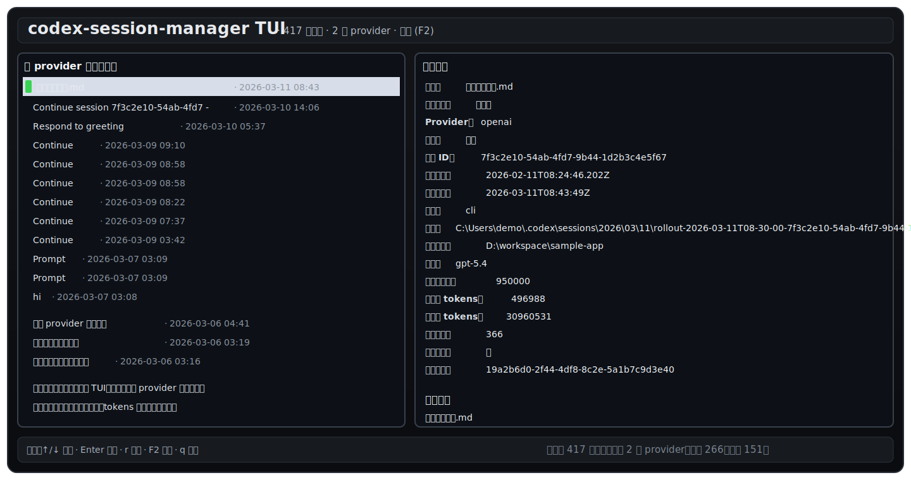

# 🌟 CSM (Codex Session Manager)
[English](./README.md)

**简单、直观的 Codex 会话管理与修复工具**


在使用 Codex 时，你是否遇到过对话历史错乱、换模型后无法继续聊天，或者想要整理旧对话却无从下手？**CSM 就是你的“会话大管家”与“急救箱”。**

它提供了一个非常直观的图形界面（TUI）和简单的命令行工具，让你安全地查看、修复、迁移你的 Codex 对话，而无需手动去改那些复杂的底层文件。

> **🚀 最快上手体验：**
> 什么参数都不用加，直接运行 `cargo run --`，就能打开下面这个直观的交互界面！
> 


---

## ✨ 核心亮点：它能帮你做什么？

1. **🏥 抢救坏掉的对话 (Session Repair)**
对话加载不出来了？CSM 可以一键帮你从底层历史记录中重建并修复对话状态。
2. **🚚 无痛换模型/服务商 (Provider Migration)**
想把当前的对话无缝切换到另一个大模型（比如换到拥有更大上下文的模型）？CSM 提供引导式的“搬家”服务，不丢失历史记录。
3. **🧳 轻量继任会话 (Distill)**
当一个长期沿用的项目对话变得越来越重、越来越难恢复时，CSM 可以把它的有效历史提炼成一个更轻的新会话，显著降低冷启动成本。提炼支持三档压缩：`lossless`、`balanced`（默认）和 `aggressive`。
4. **🧪 首轮请求预演 (First-Request Preview)**
CSM 可以重建 Codex 在 resume 后下一次真正会发送的请求，包含重建后的历史、base instructions 与内置工具 schema 估算，方便你在打开重会话前先看清冷启动成本。
5. **🔍 历史对话透视镜 (Inspection)**
清晰地看到每个对话到底用了哪个模型、消耗了多少 Token、当前的上下文占用量是多少。
6. **🛡️ 绝对安全 (Safe-by-default)**
CSM 的所有操作都遵循 Codex 原生规则，不会强行篡改或损坏你的原始聊天记录。

---

## 🚀 推荐用法：“傻瓜式”智能向导

如果你不想记任何复杂的命令，日常操作只需要记住这一个：`smart`。

**`smart` 模式是 CSM 最核心的功能。** 你只需要告诉它你想处理哪个对话，它就会弹出一个引导菜单，让你选择想要切换的服务商或模型，然后它会自动帮你判断：是直接在原对话上修复、平滑迁移到一个新对话，还是提炼出一个可选压缩等级的轻量继任会话。

默认情况下，`smart` 及相关流程**不会**自动往 `config.toml` 写入新 profile。只有你显式传入 `--write-profile` 时，才会把运行时配置持久化。

```powershell
# 启动智能向导，<ID> 替换为你的对话ID或路径
cargo run -- smart <对话的ID或路径>

```

如果你的核心问题是“一个项目长期共用一个会话，结果恢复越来越慢”，
那就优先使用 `distill`，把旧对话提炼成一个更轻的继任会话：

```powershell
cargo run -- distill <对话的ID或路径>
```

压缩等级建议：
- `lossless`：尽量保留更多纠正、规范和当前上下文
- `balanced`：新的默认档，明显减重，同时保留安全实现所需细节
- `aggressive`：最接近旧版极简提炼风格

---

## 💻 可视化操作界面 (TUI) 指南

直接运行 `cargo run --` 即可进入可视化界面。系统会根据你的电脑语言自动适配（支持中/英文）。

* **主界面**：按**持久化 provider**（rollout 元数据里记录的 provider）对你所有的对话进行分类。这样列表归属和你后续实际选择的运行时 provider 会清楚分开。
* **操作菜单**：选中一个对话按下 `Enter`（回车），就会弹出该对话的专属操作菜单（包含 `smart` 智能迁移、修复、重命名等）。
* **快捷键**：
* `↑ / ↓`：上下移动
* `Enter`：打开操作菜单 / 确认
* `Esc`：返回上一级
* `r`：刷新列表
* `F2`：切换中/英文界面
* `q`：退出


---

## 🛠️ 常用命令速查 (CLI)

对于喜欢命令行的进阶用户，CSM 也提供了丰富的直接操作指令：

### 🟢 日常管理

* **查看对话详情**：`cargo run -- show <ID>` （加上 `--json` 可以输出代码格式）
* **预演首轮完整请求**：`cargo run -- first-token-preview <ID>` （重建下一次 resume 请求，并估算历史、base instructions、工具 schema 与总提示词体积）
* **给对话改个名**：`cargo run -- rename <ID> "我的新项目对话"`
* **复制恢复命令**：`cargo run -- copy-deeplink <ID>` （复制一串命令，发给别人或在其他终端直接恢复该对话）
* **归档/取消归档**：`cargo run -- archive <ID>` 或 `unarchive <ID>`

### 🟡 进阶与迁移

* **Smart 智能向导**：`cargo run -- smart <ID>` （在交互式选择器里选择 provider、model、执行模式，以及提炼压缩等级）
* **分支对话 (Fork)**：`cargo run -- fork <ID> --provider openrouter --model gpt-5` （基于当前对话分出一个新对话，并使用新模型）
* **瘦身压缩 (Compact)**：`cargo run -- compact <ID>` （压缩对话历史，释放上下文空间）
* **手动迁移 (Migrate)**：`cargo run -- migrate <ID> --provider ...` （专为从大窗口模型迁移到小窗口模型设计，会自动帮你压缩并分支）
* **提炼轻量继任会话 (Distill)**：`cargo run -- distill <ID> --compression-level balanced` （生成 deterministic handoff brief，并创建一个更轻的新会话）

### 🔴 故障急救 (Repair)

* **重建元数据**：`cargo run -- repair <ID>` （当对话列表里的信息和实际文件不匹配时使用）
* **修复恢复状态**：`cargo run -- repair-resume-state <ID> --context-window 258400` （当旧对话因为上下文窗口数据陈旧而无法打开时，用这个原地修复）
* *注：如果是重度元数据修改，可以使用 `rewrite-meta` 命令。*

---

## 💡 给技术人员的简要说明 (Under the Hood)

CSM 虽然提供了高层的封装，但绝非“魔法”。它**不会**发明隐藏的对话状态，也**不会**通过盲目重写历史来伪造迁移。

* **数据源真实**：它直接操作 `$CODEX_HOME` 下真实的 Codex rollout 文件和配置状态。
* **原生语义**：底层直接复用了 Codex 的 Rust 核心逻辑（如 `ThreadManager::fork_thread`，`Op::Compact` 等）。
* **文件结构**：核心逻辑位于 `src/operations.rs`（原生操作）与 `src/rollout_edit.rs`（JSONL 底层修复），通过 `src/commands.rs` 进行调度。
* **Prompt Reconstruction**：`first-token-preview` 与 prompt-based `distill` 会先重建模型真正可见的 resume 上下文，再进行估算或生成 successor handoff。
